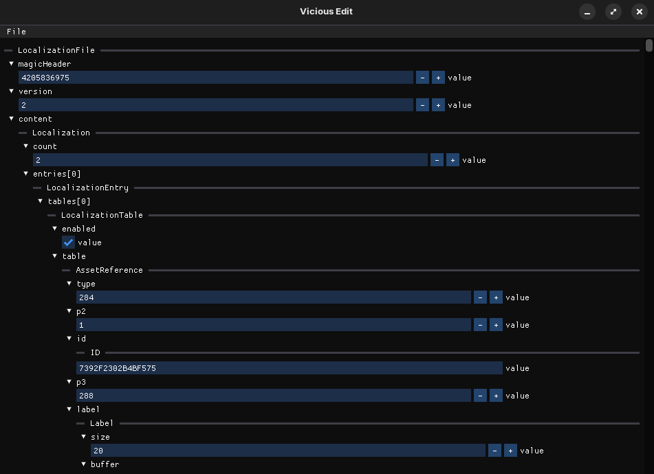

# Edit

A tiny GUI to edit asset fields in a JSON-like interface.



## Usage

```
edit asset_file
```

- asset_file: Path to asset file to edit

## FAQ

### Why is the UI so slow?

The UI really is only intended for individual asset files. Usually Vicious Engine game files come "bundled" together into one big file (ex: `.map`, `.gam`, etc). Use the `pack`/`unpack` tool to better handle this.
